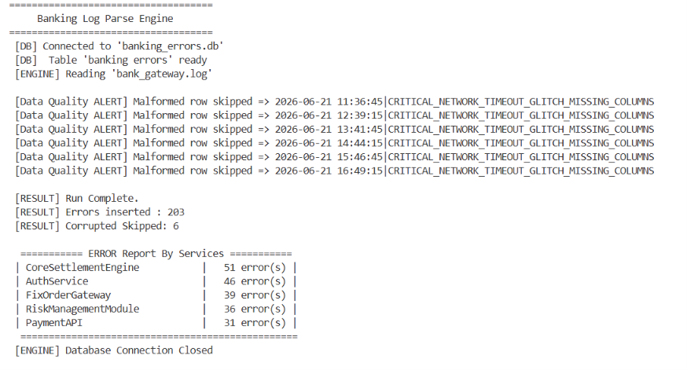

# Automated-Banking-System-Log-Parser-Engine
ETL pipeline that parses banking application logs, filters critical errors using defensive programming, and stores them in SQLite for rapid incident triage.

#  Banking Log Parser Engine

**Automated ETL pipeline for banking application platform support**

Python · SQLite · SQL · Defensive Programming · ETL Design


## Business Problem 

Every second, a banking application silently writes millions of lines into a system log file across five critical service components — FixOrderGateway, CoreSettlementEngine, AuthService, PaymentAPI, and RiskManagementModule. A real production log looks like this:

```
2026-06-21 10:15:00|INFO|CoreSettlementEngine|Inbound transaction payload validated.
2026-06-21 10:16:12|ERROR|AuthService|Database connection pool exhausted during high-volume clearing.
2026-06-21 10:17:45|WARNING|PaymentAPI|API response latency exceeded threshold limit.
2026-06-21 10:18:02|CRITICAL_NETWORK_TIMEOUT_GLITCH_MISSING_COLUMNS
2026-06-21 10:19:30|ERROR|FixOrderGateway|Database connection pool exhausted during high-volume clearing.
```

When a critical outage happens at 2 AM, a support engineer cannot manually search a log file with 1,000+ entries to find the root cause. Every minute of downtime in banking has a direct financial cost and regulatory risk. Manual log searching takes hours under pressure, is prone to human error, cannot scale to enterprise log volumes, and directly increases Mean Time to Resolution (MTTR).

---

## Solution 

This Python engine is a lightweight ETL pipeline — Extract, Transform, Load — that fully automates the triage process.

It opens the raw log file and reads it line by line in a memory-efficient manner, validates every row and skips corrupted lines without ever crashing, filters out INFO and WARNING noise so only ERROR records pass through, inserts critical errors into a structured SQLite relational database, and finally runs a SQL aggregation query to verify the stored data and surface which service component is failing most — all without any human involvement.

Root cause analysis that previously took hours now takes seconds.

---

## Project Structure

```
banking-log-parser/
│
├── log_engine.py        ← Main ETL pipeline (Python)
├── bank_gateway.log     ← Raw banking application log — 1,000 rows (input)
├── banking_errors.db    ← Auto-generated SQLite database (output)
└── README.md


The entire pipeline lives inside two functions: `parse_logs()` which runs the ETL loop, and `print_summary()` which runs the SQL verification at the end. Here is what happens at each stage.

### Extract: 

The script opens `bank_gateway.log` using `with open()` in read mode. The `with` keyword guarantees the file is automatically closed even if an error occurs mid-run. The file is read line by line rather than loading the entire file into memory at once. This is critical for banking log files that can grow to several gigabytes in production. Each line is immediately cleaned using `.strip()` to remove the hidden newline character that exists at the end of every file line.

### Transform: 

Every valid log line follows a pipe-delimited format with exactly four columns — timestamp, level, service, and message. The script calls `.split("|")` on each cleaned line, which produces a Python list of those four parts. A valid line produces a list of four items. A corrupted line with no pipe characters produces a list with only one item, which the next stage catches.


### Load: 

 After the full file loop completes, `conn.commit()` is called once to permanently save all inserts to disk. Committing in bulk after the loop rather than after every individual row is significantly more efficient at scale.

### Verify: 

The result is ordered by error count in descending order so the most-affected service appears first. This closes the full ETL loop — the data is not just stored, it is queried and verified and surfaced as an actionable report on every run.


'''
## Live Output

Running this engine against the 1,000-row `bank_gateway.log` file produces the following terminal output:


'''


Run statistics from the 1,000-row log file:

| Metric | Count |
|--------|-------|
| Total lines read | 1,000 |
| INFO rows skipped | 587 |
| WARNING rows skipped | 204 |
| Corrupted rows flagged and skipped | 6 |
| ERROR rows inserted into database | 203 |
| Program crashes | 0 |

CoreSettlementEngine generated the most errors at 51, immediately identifying it as the highest-priority component for the support team to investigate.


## Business Value

The single most important KPI for banking Application Platform Support teams is Mean Time to Resolution. This tool directly reduces it by eliminating the most time-consuming step in every incident — manually locating the root cause inside a massive, unstructured log file.

---

